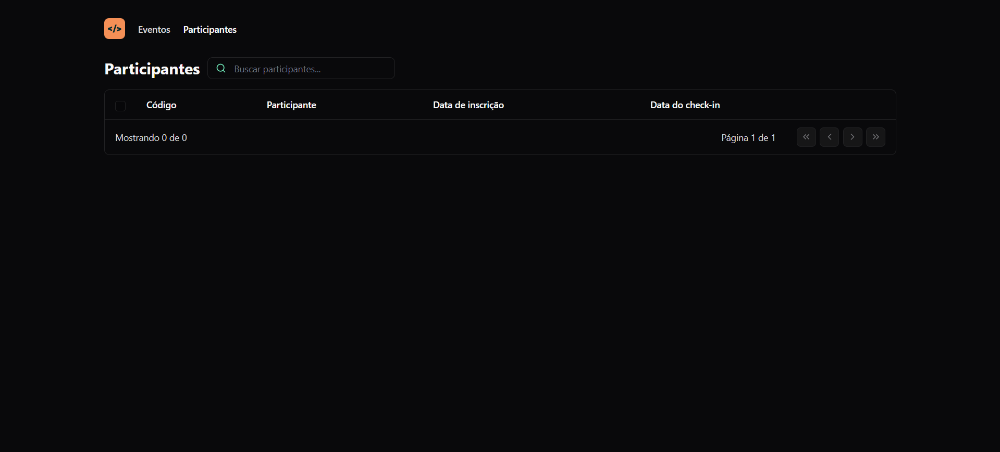

# 🧑‍💻 Página de Administração de Eventos: Pass-In!




> Este projeto foi feito ao decorrer do Evento "NLW Unite", da Rocketseat. Este projeto foi dedicado à aprendizagem e aprofudamento da Tecnologia React.

## 🪛 Ajustes e melhorias

- [ ] Adicionar Nova Página de Eventos.
- [ ] Adicionar Funcionalidade para fazer a criação de novos Eventos.
- [ ] Adicionar Funcionalidade para filtragem de determinados Eventos.
- [ ] Adicionar ReactRouterDOM para fazer troca de paginação.
- [ ] Adicionar Funcionalidade para filtragem de participantes pelo seu código.
- [ ] Adicionar Funcionalidade para filtragem dos participantes que fizeram check-in.
- [ ] Adicionar Funcionalidade para filtragem dos participantes que não fizeram check-in.
- [ ] Adicionar Botões: Excluir/Editar/Mover -> Para Participantes e Eventos

## 💻 Pré-requisitos

Antes de começar, verifique se você atendeu aos seguintes requisitos:

- Você instalou a versão mais recente do `Visual Studio Code | Git | GitBash`

## 🚀 Clonando a página de Administração

Para clonar a página para sua máquina, siga este passo a passo:
1. Crie uma pasta vazia para no futuro clonar o projeto. Pode inserir qualquer nome nela.

2. Após criá-la, entre no GitBash e utilize o comando 'cd' + o caminho onde a pasta se encontra. Ex:
```
cd C:/Pasta-Pass-In-NLW
```
3. Após entrar na pasta, tilize o Comando 'git init'.
```
$ git init
```
4. Depois de inicializar o Git, crie uma branch local:
```
$ git branch -M main
```
5. Após criar a sua branch, é só clonar este repositório utilizando este comando:
```
$ git clone https://github.com/JairoNetoDev/Pass-In-NLW.git
```
6. Abra o VSCode e coloque a pasta clonada em um novo Workspace:
```
Open Folder -> Pasta_Clonada -> Add
```
7. Após abrir os arquivos pelo VSCode, entre no terminal e coloque o caminho onde está a pasta:
```
C:/Pasta-Pass-In-NLW/Pasta_Clonada
```
8. Por fim, após inserir o caminho da pasta pelo terminal, utilize o comando abaixo para iniciar a aplicação:
```
npm run dev
```
